# ChatGPT-WechatBot using OpenAI API via Wechty


## 项目简介

ChatGPT-WechatBot是基于OpenAI官方API利用对话模型实现的一种类chatGPT机器人，并通过Wechaty框架将其部署在微信端，从而实现机器人聊天。

**注**：本项目是本地Win10实现，不需要服务器部署（如果需要服务器部署，可以将docker部署到服务器即可）

[TOC]


## 1、环境配置

### 1.1、测试环境

（1）、Windows10

（2）、Docker 20.10.21

（3）、Python3.9

（4）、Wechaty 0.10.7


### 1.2、Docker配置

**1、下载Docker**

https://www.docker.com/products/docker-desktop/ 下载Docker

**2、开启Win10虚拟化**

cmd输入control打开控制面板，进入程序，如下图所示：

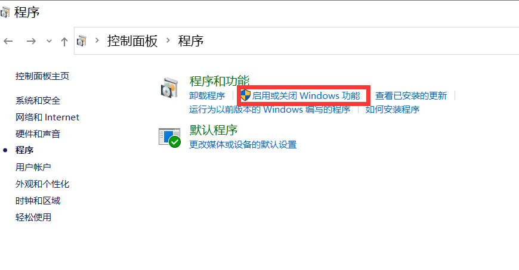

进入**启用或关闭Windows功能**，打开**Hyper-V**

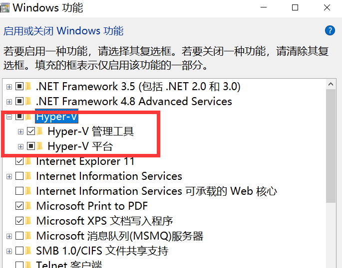

**注**:如果电脑没有Hyper-V，需要执行以下操作：

创建一个文本文档，并填入以下代码，再命名为**Hyper.cmd**

```bash
pushd "%~dp0"
dir /b %SystemRoot%\servicing\Packages\*Hyper-V*.mum >hyper-v.txt
for /f %%i in ('findstr /i . hyper-v.txt 2^>nul') do dism /online /norestart /add-package:"%SystemRoot%\servicing\Packages\%%i"
del hyper-v.txt
Dism /online /enable-feature /featurename:Microsoft-Hyper-V-All /LimitAccess /ALL
```

然后以管理员身份运行此文件，待脚本运行完，重启电脑后便有**Hyper-V**节点

**3、运行Docker**

**注**：如果第一次运行Docker出现以下情况：


需要下载最新的WSL 2包

https://wslstorestorage.blob.core.windows.net/wslblob/wsl_update_x64.msi


更新之后便可以进入主页面，然后更改docker engine里面的设置，将镜像换成阿里云的国内镜像：

```xml
{
  "builder": {
    "gc": {
      "defaultKeepStorage": "20GB",
      "enabled": true
    }
  },
  "debug": false,
  "experimental": false,
  "features": {
    "buildkit": true
  },
  "insecure-registries": [],
  "registry-mirrors": [
    "https://9cpn8tt6.mirror.aliyuncs.com"
  ]
}
```


这样拉去镜像速度较快（对于国内）

**4、拉去Wechaty镜像**：

```b
docker pull wechaty:0.65
```

因为测试时发现0.65版本的wechaty最稳定

拉去镜像后：

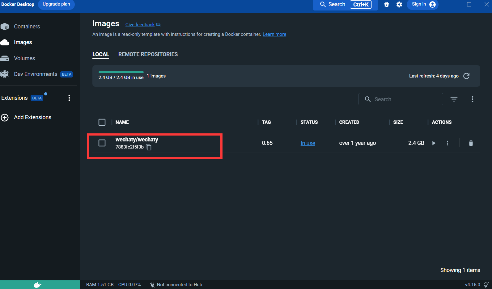

### 1.3、申请Puppet的token

**Puppet**：想使用wechaty开发微信机器人，需要使用一个中间件Puppet来控制微信的操作，官方把Puppet翻译为傀儡，目前有多种Puppet可以使用，不同版本的Puppet区别是可以实现的机器人功能不同。比如你想让你的机器人将用户踢出群聊，那就需要使用Pad协议下的Puppet。

申请连接：http://pad-local.com/#/login

**注**：申请账号后会获得一个7天时间的token

### 1.4、创建docker服务

申请token后在cmd窗口执行以下命令：

```b
docker run -it -d --name wechaty_test -e WECHATY_LOG="verbose" -e WECHATY_PUPPET="wechaty-puppet-padlocal" -e WECHATY_PUPPET_PADLOCAL_TOKEN="yourtoken" -e WECHATY_PUPPET_SERVER_PORT="8080" -e WECHATY_TOKEN="1fe5f846-3cfb-401d-b20c-sailor==" -p "8080:8080" wechaty/wechaty:0.65

```

参数说明：

**WECHATY_PUPPET_PADLOCAL_TOKEN**：申请好的token

**WECHATY_TOKEN **：随机写一个保证唯一的字符串即可

**WECHATY_PUPPET_SERVER_PORT**：docker服务端端口

**wechaty/wechaty:0.65**：wechaty镜像的版本

**注：**- “8080:8080”* 是你本机以及docker服务端的端口，注意docker服务端端口要和WECHATY_PUPPET_SERVER_PORT保持一致

运行之后，便在docker desktop的面板中看容器：

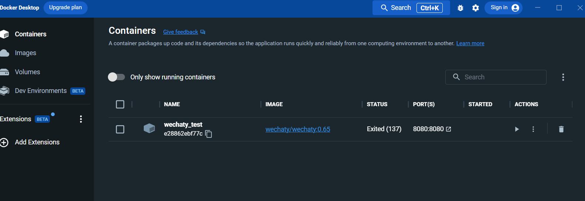

进入日志界面：

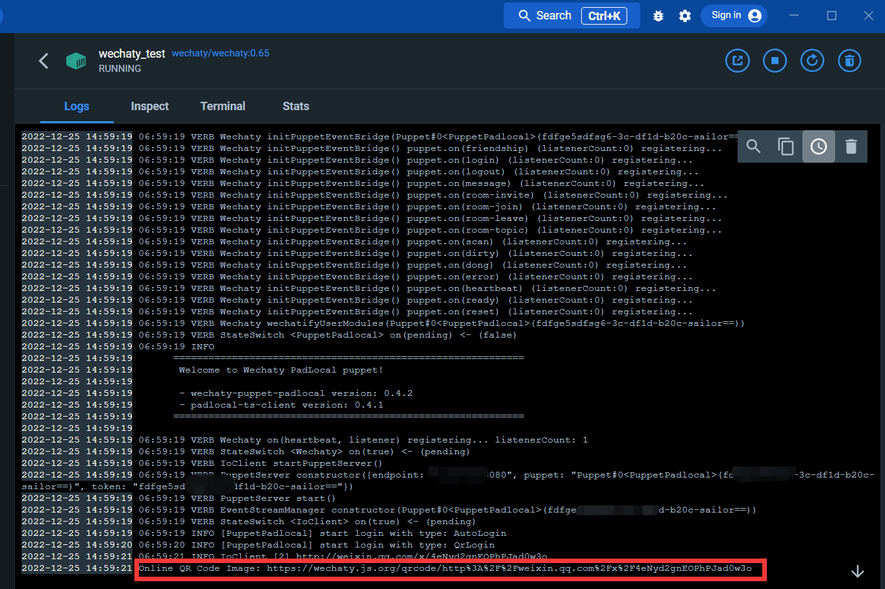

通过下方的链接，便可以扫码登录微信

登录之后，docker的服务变搭建完成

### 1.5、Python环境搭建

安装**wechaty**和**openai**库

打开cmd，执行以下命令：

```ba
pip install wechaty
```

```bash
pip install openai
```

### 1.6、获取openAI API-key

登录openAI

https://beta.openai.com/

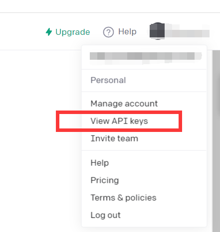

点击**View API keys**

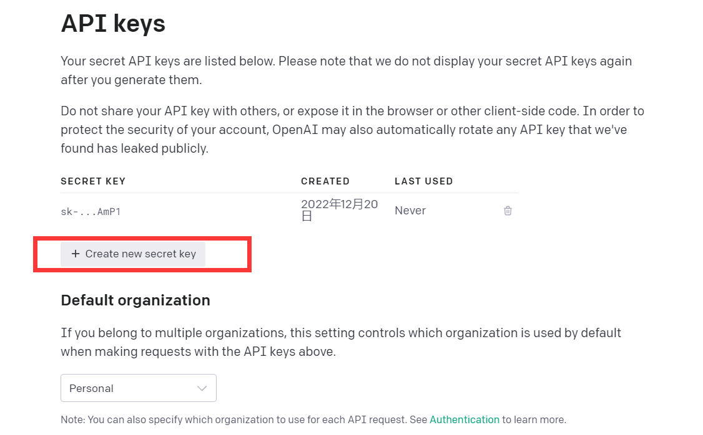

获得API kyes即可

**至此，环境搭建完毕**

## 2、ChatGPT-WechatBot

### 2.1**快速开始**

可以尝试阅读这段**demo**代码

```py
import openai

openai.api_key = "your API-KEY"
start_sequence = "A:"
restart_sequence = "Q: "
while True:
    print(restart_sequence,end="")
    prompt = input()
    if prompt == 'quit':
        break
    else:
        try:
            response = openai.Completion.create(
              model="text-davinci-003",
              prompt = prompt,
              temperature=0.9,
              max_tokens=2000,
              frequency_penalty=0,
              presence_penalty=0
            )
            print(start_sequence,response["choices"][0]["text"].strip())
        except Exception as exc:
            print(exc)


```

这段代码调用的是与chatGPT一样模型的CPT-3模型，回答效果也不错

openAI的[GPT-3](https://beta.openai.com/docs/models/gpt-3)模型介绍如下：

Our GPT-3 models can understand and generate natural language. We offer four main models with different levels of power suitable for different tasks. Davinci is the most capable model, and Ada is the fastest.

| LATEST MODEL     | DESCRIPTION                                                  | MAX REQUEST  | TRAINING DATA  |
| :--------------- | :----------------------------------------------------------- | :----------- | :------------- |
| text-davinci-003 | Most capable GPT-3 model. Can do any task the other models can do, often with higher quality, longer output and better instruction-following. Also supports [inserting](https://beta.openai.com/docs/guides/completion/inserting-text) completions within text. | 4,000 tokens | Up to Jun 2021 |
| text-curie-001   | Very capable, but faster and lower cost than Davinci.        | 2,048 tokens | Up to Oct 2019 |
| text-babbage-001 | Capable of straightforward tasks, very fast, and lower cost. | 2,048 tokens | Up to Oct 2019 |
| text-ada-001     | Capable of very simple tasks, usually the fastest model in the GPT-3 series, and lowest cost. | 2,048 tokens | Up to Oct 2019 |

While Davinci is generally the most capable, the other models can perform certain tasks extremely well with significant speed or [cost advantages](https://openai.com/api/pricing). For example, Curie can perform many of the same tasks as Davinci, but faster and for 1/10th the cost.

We recommend using Davinci while experimenting since it will yield the best results. Once you’ve got things working, we encourage trying the other models to see if you can get the same results with lower latency. You may also be able to improve the other models’ performance by [fine-tuning](https://beta.openai.com/docs/guides/fine-tuning) them on a specific task.

简言之，功能最强大的 GPT-3 模型。可以完成其他模型可以完成的任何任务，通常具有更高的质量、更长的输出和更好的指令遵循。还支持在文本中插入补全。


### 2.2、实现对话功能

虽然直接使用text-davinci-003模型，可以达到chatGPT单轮对话的效果；但是为了更好实现与chatGPT一样的多轮对话的效果，可以设计一个对话模型。

#### 2.2.1、基于chat background的对话模型

基本原理：告诉**text-davinci-003模型**当前对话的背景

实现方法：设计对话记忆队列，用于保存当前对话的前**k**轮对话，并在提问前告诉**text-davinci-003模型**，前**k**轮对话的内容，然后再通过**text-davinci-003模型**获得当前回答的内容

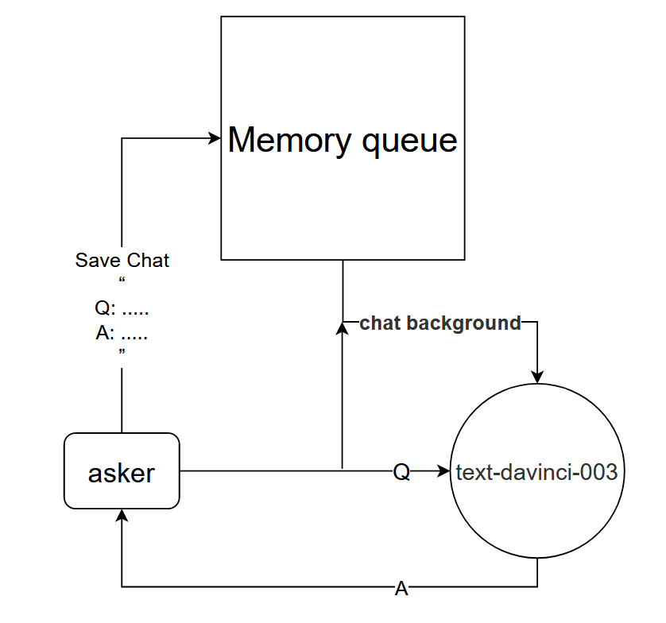

这种方法的效果竟然出奇的好！给出部分chat的记录

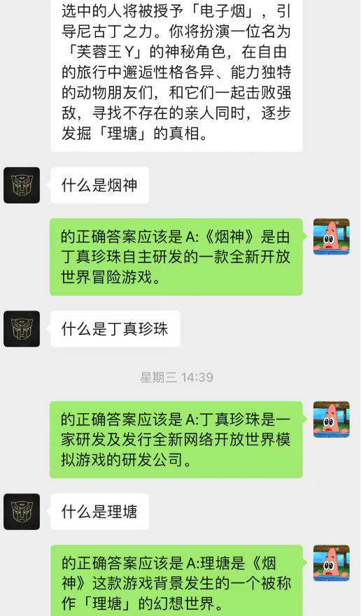 				   

可见，目前通过chat-backgroud还可以让AI完成情景学习

不但如此，还可以实现和chatGPT一样的引导式写文章

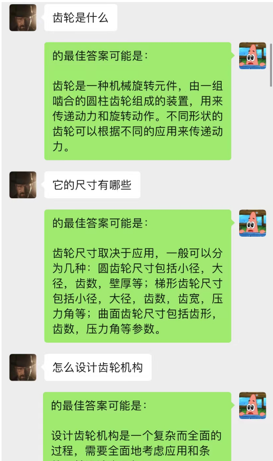				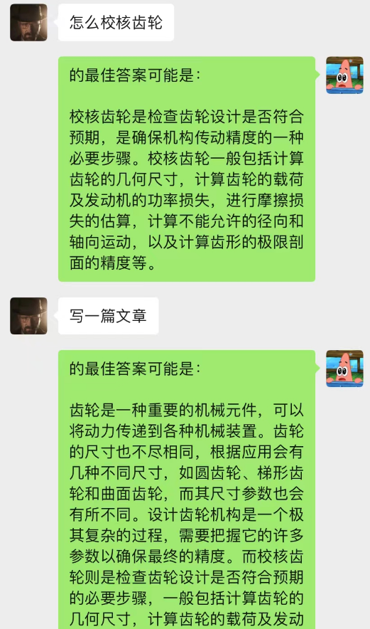

#### 2.2.2、动态N-gram马尔科夫链的上下文关系的chat-backgroud对话模型

这个模型是我目前构思的优化chat-backgroud对话模型的一种方法，其基本逻辑和N-gram语言模型一样，只不将N是动态变化的，加上马尔科夫性，就可以预测当前对话与上下文之间的关系，从而判断chat-backgroud中那段是最为重要的，从而根据最重要的记忆对话内容，再结合目前问题利用text-davinci-003模型，给出回答（相当于让AI在聊天中做到，利用之前的聊天内容）

这个模型的实现需要大量数据进行训练，代码还没完成


------**挖坑**：代码实现后，更新这部分详细步骤


### 3、整合项目

项目基本逻辑，如下图所示：

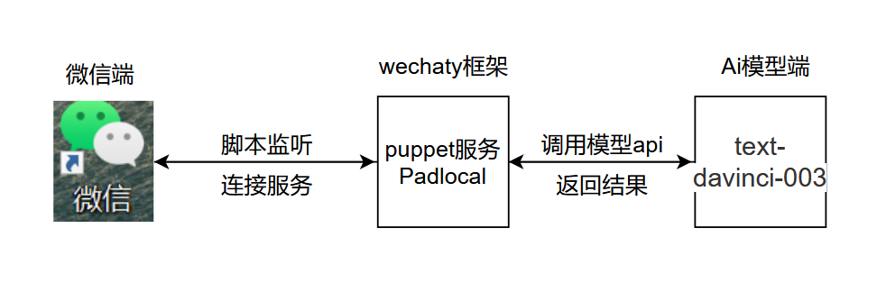.py，在图示位置添加打开chatGPT.py，在图示位置添加秘钥和配置环境变量

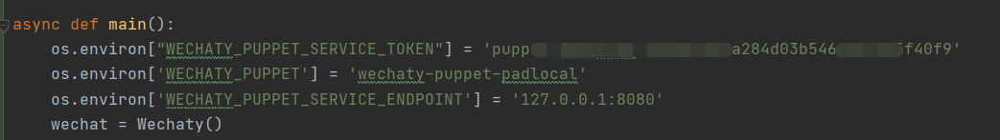

**代码解释**：

```py
os.environ["WECHATY_PUPPET_SERVICE_TOKEN"] ="填入你的Puppet的token"
```

```py
os.environ['WECHATY_PUPPET'] = 'wechaty-puppet-padlocal'#保证与docker中相同即可
```

```
os.environ['WECHATY_PUPPET_SERVICE_ENDPOINT'] = '主机ip:端口号'
```

运行成功

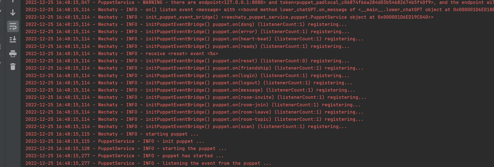


### 附：防微信被封的一些建议

1、在docker中登录，不要使用python中wechaty的登录

2、在代码中设置**time.sleep()**,模拟人回复消息的速度

3、最好测试时不要使用大号，建议创建一个ai专用小号测试


### 免责声明

该项目中的内容仅供技术研究与科普，不作为任何结论性依据，不提供任何商业化应用授权，不为任何行为负责

### 项目合作联系方式：

~~email：fatzard_h21@outlook.com